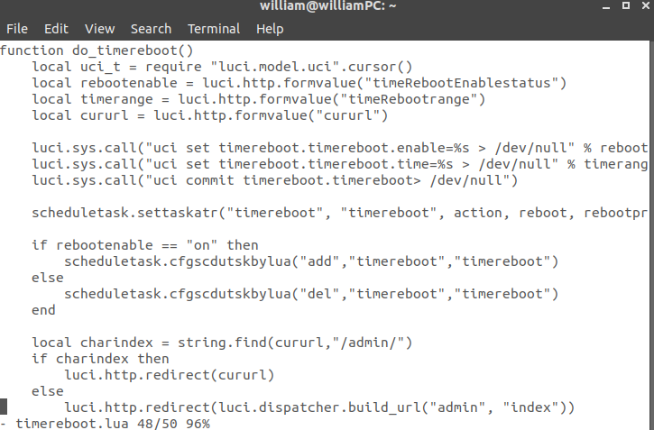

- **Vendor Of The Product**

    PHICOMM

- **Affected Products and Firmware version**

    PHICOMM  K2(PSG1218)    V22.5.9.163

- **Vulnerability**

    Remote Code Execution

- **Exploitation**

    Remote command execution on the root shell by modifying the contest in the http post request .

- **Affected Components**

    Affected source code file: /usr/lib/lua/luci/controller/admin/timereboot.lua

    Affected function: do_timereboot()

- **Vulnerability Details**

    Firstly, After the web login Authentication or a session hijack vulnerability, or a weak credentials brute force attack to get access permissions, we can send a crafted packet to the device by changing the related element in the browser console:

Once click the save button, we add the command we want to execute *reboot* to the http packet contest.

we could see the script in the head tag that the clicked save button triggers the function to submit the reboot time to the server without checking whether it's valid in the front-end.

Then,we can see that the server append the data to a command directly without checking whether the data is modified maliciously too, causing the command attacker want to execute appended to the command.

Finally, the router will execute the command "reboot", which causing a DoS.
