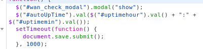
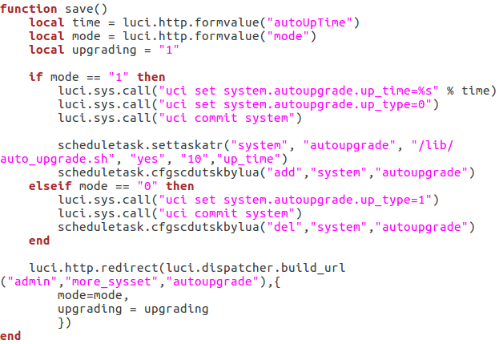

- **Vendor Of The Product**

    PHICOMM

- **Affected Products and Firmware version**

    PHICOMM  K2(PSG1218)    V22.5.9.163

- **Vulnerability**

    Remote Code Execution

- **Exploitation**

    Remote command execution on the root shell by modifying the content in the HTTP post request.

- **Affected Components**

    Affected source code file: /usr/lib/lua/luci/controller/admin/autoupgrade.lua

Affected function: save()

- **Vulnerability Details**

    Firstly, After the web login Authentication or a session hijack vulnerability, or a weak credentials brute force attack to get access permissions, sending a crafted packet to the device:

    ```shell
    curl -i -s -k -v -X'POST'  -e "http://192.168.2.1/cgi-bin/luci/;stok=xxx/xxx/xxx/xxx" -b "sysauth=4a2c4bdba5fb1273ce62759fd42dba42" --data-binary "mode=1&autoUpTime=02%3A05|reboot" 'http://192.168.2.1/cgi-bin/luci/;stok=xxx/admin/xxx/xxx/xxx'
    ```

    In this http packet, we add the command we want to execute *'reboot'* to the packet content.

   

    We could see that the value of *'autoUpTime'* is assigned to a variable directly without checking whether the value is modified maliciously and then sent to the server.

    

    Then, the server appends the data to a command directly without checking whether the data is modified maliciously too, causing the command that the attacker wants to execute to be attached to the command.

    Finally, the router will execute the command "reboot", which causes a DoS.
    
- **CVE-ID**
   
   [CVE-2019-19117](https://cve.mitre.org/cgi-bin/cvename.cgi?name=CVE-2019-19117)
   
This vulnerability is detected by NESA Lab (nesa.zju.edu.cn), with our custom tool. Please contact liupeiyu@zju.edu.cn if you need more info about the team, the tool or the vulnerability.
